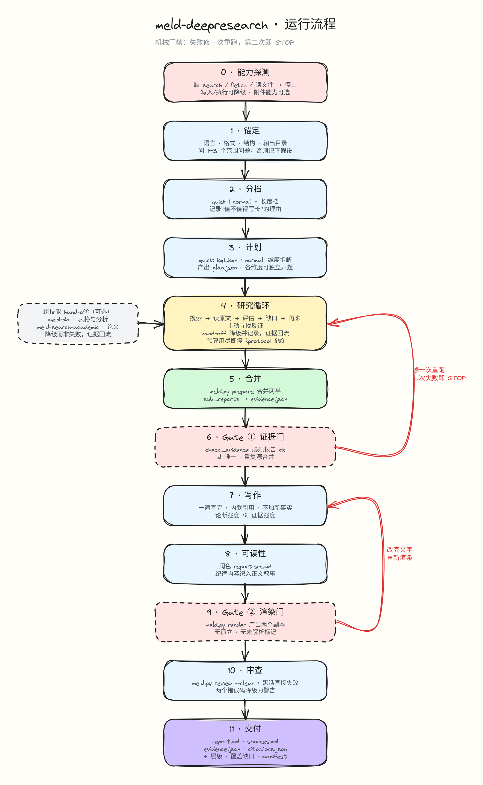

# meld-deepresearch

🌐 **中文** · [<kbd>English</kbd>](../README.md)

[](https://github.com/RichardLitt/standard-readme)

一个轻便、可移植的 Agent Skill 系列，产出可核查、有引用支撑的深度研究报告。

一个可移植的 Agent Skill，把含糊的话题变成一份可核查、有引用
支撑的研究报告。它遵循 Agent Skills 开放标准（`SKILL.md`），
任何兼容的主机都能直接从路径加载它——不需要框架，也不绑定厂
商。本仓库提供三个互相配合的 skill：核心研究循环，加上两个可
选的能力 skill。

## 目录

- [安装](#安装)
- [用法](#用法)
- [它能给你什么](#它能给你什么)
- [本仓库的 skills](#本仓库的-skills)
- [一次运行如何进行](#一次运行如何进行)
- [运行闸门](#运行闸门)
- [产物](#产物)
- [何时该用 / 何时不该用](#何时该用--何时不该用)
- [环境要求](#环境要求)
- [文档](#文档)
- [验证](#验证)
- [贡献](#贡献)
- [许可证](#许可证)

## 安装

有两条一行命令可以装，**用你已有的那个 CLI 即可——两者是二选一，不是两步**：

- `npx skills add`（skills.sh CLI）需要 **Node.js**。
- `gh skill install` 需要 **GitHub CLI v2.90+**（`gh skill` 命令目前处于预览阶段）。

三个 skill 全部安装 —— 下列两行**只挑一行**：

```bash
npx skills add sogeisetsu/meld-deepresearch --all    # 有 Node.js
gh skill install sogeisetsu/meld-deepresearch --all  # 有 GitHub CLI v2.90+
```

只装核心 skill —— 同样二选一，只是点名那一个 skill：

```bash
npx skills add sogeisetsu/meld-deepresearch --skill meld-deepresearch
gh skill install sogeisetsu/meld-deepresearch meld-deepresearch
```

手动安装（不用 CLI）：把 [`skills/`](../skills/) 下的各 skill 目录复制到主机的
skill 目录（例如 `~/.agents/skills/`）。

说明：

- `npx` 与 `gh` 是通过两种不同工具安装**同一批** skill——两条都跑会装两遍。
- 裸用 `gh skill install owner/repo <name>` 只会安装那一个具名的 skill
  ——要装全部三个请加 `--all`。
- 非交互运行时 `gh` 默认 `--agent github-copilot`，因此要传
  `--agent <host>`；`npx` 对应的写法是 `-a <host>`。
- 两个 CLI 都通过 `skills/*/SKILL.md` 约定发现本仓库的三个 skill。

## 用法

1. 把本仓库克隆到磁盘上任意位置。
2. 把你的主机指向它：主机通过读取 `skills/<name>/SKILL.md` 来
   加载 skill。各主机的 skill 目录列在你所用主机自己的文档里；
   项目内的 `skills/` 目录在多数主机上都能用。
3. 可选——能力 skill 需要安装其各自 `requirements.txt` 中列出
   的包。没有这些包，skill 会降级到文档记载的回退方案。
4. 开一个新会话，提出研究需求：一份带引用的报告、一次对比、一
   篇文献综述、一次事实核查。skill 的 `description` 负责匹配；
   没有任何需要配置的东西。
5. 从该次运行的输出目录里取走交付物（见**产物**）。

skill 加载之后，一次典型的提问：

```text
就这个主题写一份带引用的对比报告——每条断言都有来源，缺口与矛盾
如实报告，未经核实的论断标为 unknown。
```

核心 skill 复用主机自己的检索、抓取、文件与命令能力；它不附带
任何密钥，也不存储任何凭据。

## 它能给你什么

- 每条断言都链接到一份真正打开过的来源；任何未经核实的内容都
  标为 `unknown`，绝不猜测。
- 反证是被主动去寻找的——矛盾与缺口会被如实报告，而不是被抹
  平。
- 三道硬闸门拦住糟糕的运行——`meld.py prepare`（闸门①）、`meld.py render`
  （闸门②）与 `meld.py review --clean`（内容闸门；三者都是薄 CLI
  `skills/meld-deepresearch/scripts/meld.py` 的子命令，包装着底层脚本）：证据契约由 `check_evidence.py` 校验，
  `render_citations.py` 拒绝孤儿或未解析的标记，阅读版由三个硬性交付错误码
  判定——另有两种形态（`E_STANDALONE_SECTION`、`E_ADVERSARY_CALLOUT`）
  以警告报告——它们的确切含义与并列在旁的只警告清单见
  [`references/protocol.md`](../skills/meld-deepresearch/references/protocol.md) §9。
- 两档努力级别 `quick` 与 `normal`，根据问题选择、可手动覆盖
  ——不需要多智能体机制。
- 一次渲染器运行同时产出两份报告文件：`report.md`，即你交付出
  去的阅读版，以及带引用标注的 `report.cited.md`，它作为中间产
  物留在 `.work/`，不是交付物。
- 核心脚本只用 Python 3 标准库；skill 本身没有运行时依赖。
- 文件才是事实来源：产物落到磁盘上，模型上下文里只留结论。

## 本仓库的 skills

| 目录 | 用途 | 依赖 |
|---|---|---|
| `skills/meld-deepresearch` | 核心研究 / 证据 / 引用循环 | 无——Python 3 标准库 |
| `skills/meld-da` | Excel 与电子表格数据分析工作流（据 SenseNova-Skills `sn-da-excel-workflow` 改写） | `requirements.txt` 中的可选 Python 包；缺包时按文档降级 |
| `skills/meld-search-academic` | 学术检索、论文阅读、引用树追溯（据 SenseNova-Skills `sn-search-academic` 改写） | `requirements.txt`（外加 `requirements-optional.txt`）中的可选 Python 包；缺包时按文档降级 |

每个 skill 都能独立使用；它们只有在
[`references/protocol.md`](../skills/meld-deepresearch/references/protocol.md)
§2a 记载的交接点上才能互相调用。

## 一次运行如何进行

```text
probe → clarify → tier → plan → per-axis research → merge → gate ①
     → write → draft review → readability pass
     → gate ② (dual render) → content gate → deliver
```



- **probe** —— 检查主机具备哪些能力；缺少某个阻塞性能力时终止
  运行并说明。
- **clarify** —— 最多三个问题，或者在无人可答时写下明确的假
  设。
- **tier** —— `quick`（一条自成一体的线程）或 `normal`（若干可
  独立检索的维度）。
- **plan** —— `normal` 运行会在 `plan.json` 中写明研究维度与关
  键问题。
- **per-axis research** —— 检索 → 打开原始页面 → 评估 → 补充池
  子（每档轮次上限见 [`references/protocol.md`](../skills/meld-deepresearch/references/protocol.md)
  §8；摘要片段永远不算证据：§2 规则 3）。
- **merge** —— `meld.py prepare`（其合并的一半，底层为 `merge_evidence.py`）
  把各维度的文件折叠成一份 `evidence.json`。
- **gate ①** —— 同一个 `meld.py prepare` 随后对合并后的文件跑
  `check_evidence.py`（`normal` 档还要加 `--plan`，当 `.work/plan.json`
  存在时自动添加）；失败即终止运行。
- **write** —— 只依据已校验的证据写出一份草稿 `report.src.md`；头部信息
  块、目录、标题规则以及草稿阶段独立成节的纪律章节，都在
  [`references/report-template.md`](../skills/meld-deepresearch/references/report-template.md)
  中规定。
- **draft review** —— 只警告的结构性检查（章节顺序与预期章节）
  跑在草稿 / 引用版上。
- **readability pass** —— 纪律材料在每个标题层级织进叙事，每一处
  `unknown` 标记都在织入之后保留下来；织入规则与交付闸门检查的形态见
  [`references/report-template.md`](../skills/meld-deepresearch/references/report-template.md)。
- **re-gate** —— 散文修改后只需重跑交付闸门：`meld.py review --clean`。
- **dual render** —— 一次 `meld.py render` 运行（闸门②；底层为
  `render_citations.py`）同
  时产出两份文件：`report.cited.md` 进入 `.work/`，它去掉标记的
  孪生兄弟 `report.md` 落在顶层；阅读版从不带 `## Observations` 一节——观
  测记录留在 `evidence.json` 和 `.work/report.cited.md` 里。
- **content gate** —— 对 `report.md` 跑
  `meld.py review --clean`（底层为 `content_review.py --clean`），即交付闸门：
  三个错误码时退出码 1——`E_RUNTIME_TERM`、`E_FAILURE_NARRATION` 与
  `E_APPARATUS_LEAK`——而 `E_STANDALONE_SECTION`（独立成章的章节）与
  `E_ADVERSARY_CALLOUT`（加标签的提示块）会被检出并以警告报告，退出码 0。
  每个错误码的含义与只警告的清单见
  [`references/protocol.md`](../skills/meld-deepresearch/references/protocol.md)
  §9。
- **deliver** —— `meld.py sources`（底层为 `dedupe_sources.py`）写出去重后的
  `sources.md`，
  然后报告完整的产物清单，包括缺口与抓取失败。

失败闸门或阶段的停止规则——修复一次然后重跑，再次失败就停止、如实报告
而不是交付——见
[`references/protocol.md`](../skills/meld-deepresearch/references/protocol.md)
§9–§10。

## 运行闸门

[`references/protocol.md`](../skills/meld-deepresearch/references/protocol.md)
§9 是权威命令清单：复制它的 `OUTDIR` 闸门命令块，在技能自身目录下运行。
`scripts/meld.py` 是包装底层脚本的薄 CLI（`prepare`、`render`、
`review [--clean]`、`sources`、`verify`）；底层脚本（`merge_evidence.py`、
`check_evidence.py`、`render_citations.py`、`content_review.py`、
`dedupe_sources.py`）保持等价、仍可各自独立运行——两种形式并列放在那个
§9 块中。

## 产物

默认目录 `meld-deepresearch-reports/YYYY-MM-DD-{slug}-{hex4}/`
（命名规则与用户提供的路径对它的影响见
[`references/protocol.md`](../skills/meld-deepresearch/references/protocol.md)
§11）：

| 文件 | 内容 |
|---|---|
| `report.md` | **交付物**——无标记的阅读版：首行指针 → 头部信息块 → 目录 → 正文 → `## Sources`；它从不带 `## Observations` 一节 |
| `sources.md` | 去重后的来源清单 |
| `evidence.json` | 合并后、通过闸门校验的证据，支撑每一条断言 |
| `citations.json` | 把标记链接到其来源的引用映射表 |

与它们并排的 `.work/` 存放中间产物：`plan.json`（normal 档）、
渲染前的草稿 `report.src.md`、同一次渲染产生的带引用标注的
`report.cited.md`（中间产物，不是交付物），以及各维度的
`sub_reports/`。

## 何时该用 / 何时不该用

**该用的时候**：答案必须建立在不止一份来源之上、并且可核查：格局
或趋势扫描、竞品对比、文献综述、事实核查，以及任何明确要求带引
用的报告或简报。

**不该用的时候**：一个直接回答就够：定义、一行就能查到的问题、整
理你已有的来源、纯改写或翻译，或者本就不期待证据的观点文章。

## 环境要求

- 一个实现了 Agent Skills 标准（`SKILL.md`）的主机。
- 网络检索、页面抓取、文件读写与命令执行能力；当可选能力缺失时
  skill 会优雅降级，并在输出中说明。
- 运行闸门与渲染器需要 Python 3（核心 skill 只用标准库）。
- 可运行于 Linux、macOS 与 Windows；两个能力 skill 各自带有
  `Platform notes (pure Windows)` 一节。

## 文档

- Skill 入口：[`skills/meld-deepresearch/SKILL.md`](../skills/meld-deepresearch/SKILL.md)
- 协议、预算、闸门：[`references/protocol.md`](../skills/meld-deepresearch/references/protocol.md)
- 证据 schema：[`references/evidence-contract.md`](../skills/meld-deepresearch/references/evidence-contract.md)
- 评测标准与三 skill 对比：[`docs/eval/README.md`](../docs/eval/README.md)
- 带注释的文件树：[`docs/FILE_TREE.md`](../docs/FILE_TREE.md)
- 开发计划与里程碑：[`docs/PLAN.md`](../docs/PLAN.md)

## 验证

完整的验证集合——正向示例、负向示例以及每一种渲染模式——列在
[`AGENTS.md`](../AGENTS.md) 中，并由 CI 执行。

## 贡献

问题欢迎开
[GitHub issue](https://github.com/sogeisetsu/meld-deepresearch/issues)——
我们很乐意帮忙。接受 Pull Request；PR 的门槛是
[`AGENTS.md`](../AGENTS.md) 中列出的验证集合全部通过。

## 许可证

MIT——见 [`LICENSE`](../LICENSE)。作者：**sogeisetsu**。
[`NOTICE`](../NOTICE) 列出了所有其材料被借用或借鉴的上游项目，
包括两个据 SenseNova-Skills 改写的技能。

---

🌐 **中文** · [<kbd>English</kbd>](../README.md)
